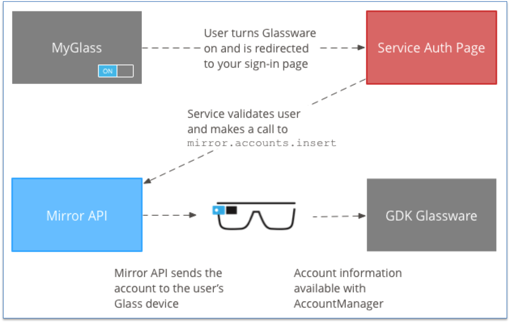
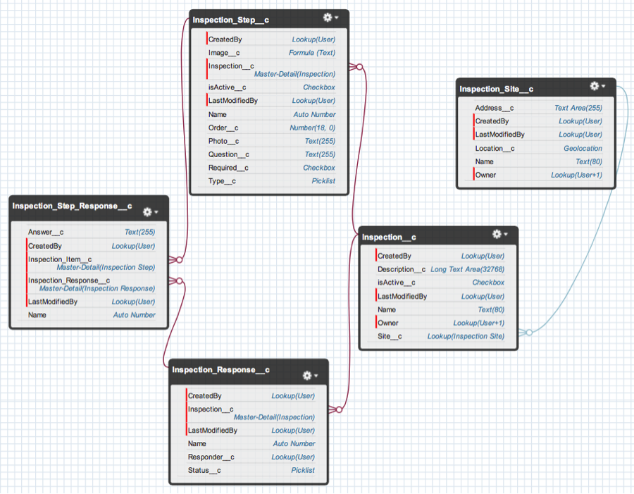

# Inspection sample app for Google Glass

Google Glass is the most advanced wearable available today: an always-on, head-mounted display, controlled by voice commands and a touchpad. The device runs Android KitKat on an embedded CPU, and currently receives firmware updates over the air from Google at the rate of about one per week -- it is a rapidly evolving platform. It can also be paired with an Android smartphone to receive supplementary sensor data such as GPS.

The Salesforce sample app for Google Glass is an app for use in on-site inspections, which might be used in the field by a pipeline inspector, for example. When the app opens, nearby inspection sites are shown contextually based on the user's current GPS location. The user can then advance through the inspection steps, answering each question with voice commands. At any step, an observed failure can automatically span a new case in Service Cloud, with the case details dictated verbally. Finally, context-sensitive video documentation can be made available and streamed from YouTube using another voice command.

The advantage of voice commands in this case is that the inspector will often be wearing gloves, or have dirty hands, making standard smartphone interactions difficult or impossible.

## Authenticating with Salesforce


Since the app runs on the Salesforce platform, it must be authenticated just like any other Salesforce app. This is the most complicated part of the project, and involves both Salesforce and Google authentication steps.

From the user's point of view, the authentication is performed as a one-time operation on the desktop, from within Google's MyGlass web portal, located at http://glass.google.com/myglass. A production app would be publicly available on this portal, but for development, the app must be uploaded to Google as a beta, with any test users "whitelisted" by Google. 

Once the app is visible on the MyGlass desktop portal, clicking on its icon brings up the familiar Salesforce login. In this dialog, type the credentials of your Salesforce org, and the app will be authorized both for Salesforce and for Glass.

This authorization process involves sending the standard Salesforce tokens through an intermediate Google API, which then makes them available to the Glass app. This desktop login process is Google's standard authentication method, because Google Glass does not support keyboard input.

Two OAuth tokens are passed from Salesforce to the Glass app: a session token and a refresh token. The session token expires eventually, but the refresh token has an unlimited lifespan. The app uses this stored refresh token to request a fresh session token if the previous session token has expired. In this way, the session appears to be unlimited from the end user's point of view, and the web-based authentication only needs to be performed once, unless the authentication is revoked manually from the MyGlass portal.

### OAuth Flow




The diagram above describes the high-level authentication flow for Google Glass apps that have to authenticate against an external service such as Salesforce. More details about this process can be [found here](https://developers.google.com/glass/develop/gdk/authentication).

In a traditional Google Glass environment, a user would register their glassware, then login and give permissions. Google does this by directing the user to a login page specified by the glassware developer. Google appends a "userToken" value to the URL, and the glassware developer is responsible for sending that userToken back to Google, along with the tokens required by the glassware to make API calls.

The standard [Salesforce OAuth 2.0 flow](https://developer.salesforce.com/page/Digging_Deeper_into_OAuth_2.0_on_Force.com) does not accept a "userToken" variable, so we could not use that as the authorization URL when configuring the glassware. However, the Salesforce OAuth 2.0 flow does accept a "state" variable, which is a general-purpose variable that can be used to pass values back and forth during the authentication process. 

As a solution, the authorization URL we have configured for the glassware is an intermediate Sites Visualforce landing page (in our case, glass-developer-edition.na10.force.com/glassauth). Google appends the user token to this URL at the start of the authorization flow. 

Once the user token value has been captured, the user is redirected automatically to the standard Salesforce login page, with the user token stored in the Salesforce state variable. After the user authorizes the app with Salesforce, they are redirected to a landing page that receives the authorization code from Salesforce (part of the [web-server OAuth 2.0 flow](https://help.salesforce.com/HTViewHelpDoc?id=remoteaccess_oauth_web_server_flow.htm&language=en_US)). This code is then exchanged for access and refresh tokens from Salesforce using a standard REST request.

After receiving the access and refresh tokens, the landing page is then responsible for sending these to Google via a Google API known as the "Mirror API", along with the user token value that was sent back from the Salesforce authorization page in the "state" variable.

Calls to the Mirror API must by authorized using OAuth as well. This is done using the server-to-server authorization flow between Salesforce and Google. A JSON Web Token (JWT) is generated and sent to Google. The JWT must be cryptographically signed using RSAwithSHA256. Apex does not currently support this encryption mode, so as a workaround, a basic signing server was created on Heroku using the "Sign server" project on GitHub (https://github.com/shunjikonishi/sign-server). The sole purpose of this server is to sign the JWT, and in future this server may be removed if RSAwithSHA256 is supported by Apex. 

After it is signed, the token request is sent to Google. Google returns an access token that is then used to make the Mirror API call to add the Salesforce access and refresh tokens to the user’s Glass. Once the tokens have been added to the Glass, they can be accessed using the standard Android AccountManager class.


## Salesforce integration

The Glassware leverages the standard [Salesforce REST APIs](https://www.salesforce.com/us/developer/docs/api_rest/) to retrieve and submit data. SOQL queries submitted via the REST interface are used to retrieve from the server all data required by the app. The JSON response is manually parsed into Java model objects for use within the app.

When the user starts the app, the app gets the user’s GPS location from the paired phone. It submits a SOQL geolocation query that requests all inspections within a certain distance from user location. This is a custom parameter that can be set to any distance from the GPS location logged.

This request returns a list of all inspection sites within a certain distance of the user, and all of the inspections available at each of those sites.

Once the user chooses the inspection site and the specific inspection, a new API call requests the inspection steps for the inspection. When the user begins the inspection, a new Inspection Response object is created via a REST request to the endpoint associated with that object. The Id returned is stored in the corresponding Java object in the app.

The user then proceeds through each inspection step. An answer is provided to the question in that step. The user can also access video ‘documentation’ about the step, and optionally take a photo using their Glass to send to Salesforce, using the 'picture' voice command.

An inspection step response object is created for each step, both in the app and in Salesforce. This request returns the ID of the Salesforce object.

Photos are uploaded to the Salesforce Attachment endpoint. The ID of the inspection step response object is sent as part of the request, so that the photo will be associated with that object.

If an inspection step fails, the user is prompted to create a new Case. As with photos, the Case is linked to the inspection step response that documents the failure.


## Data Model


An inspection site has geographical coordinates, which are queried based on the user's current GPS location. All sites within 10 miles of the user's position are returned. If no Android phone is paired, the user's location cannot be determined and the app falls back to a hard-coded demo site (using the coordinates of Moscone Center in San Francisco).


## Operating the App

On the initial splash screen, the app spends 5 seconds trying to determine the current location before falling back to the hard-coded site. At this time, tap the Glass touchpad to continue with the app.

The next card shows an available site. Slide the touchpad to advance through additional Location choices, if available. If no Inspections are available at a Location, the card will say "No inspections". Tap the touchpad to choose a Location.

The following card shows an available Inspection. Again, slide the touchpad to advance through additional Inspections at the site, if available. Each Inspection card lists its total number of steps, and if the Inspection object does not contain any steps, the card will say "No steps". Tap the touchpad to choose an Inspection.

At this point, the Inspection steps will begin. At each step, the available voice responses are shown at the bottom of the card. Note that we use only multi-syllable words as response commands, since Glass finds it difficult to parse single-syllable words like "No". The steps automatically advance after a response is given.

Note: rather than using speech-to-text for these responses, we use a "Hotwords" system, where the app only listens for specific words, and ignores all others. This also allows the app to listen indefinitely for a response, rather than stopping the listener after 5 seconds as the speech-to-text listener does.

At any step, a response of "Affirmative" (for "Affirmative/Negative" questions) or "Failure" (for "Success/Failure" questions) will automatically launch a case entry screen, which accepts voice dictation. After the case is submitted to Salesforce, the inspection steps will continue.

Also, any step with video documentation available will respond to a command of "Documentation", which will automatically play a YouTube video, with the URL fetched from the Step object on Salesforce. This video may be paused by tapping the Glass touchpad, and dismissed by swiping down on the Glass touchpad.

## Technical Notes


Google's Volley library for Android is used in the Glass app to simplify the process of making network calls. This is the same library used in the [Salesforce Android SDK](https://github.com/forcedotcom/SalesforceMobileSDK-Android). Custom request objects that extend the default Volley request objects are used, to simplify adding the required authorization headers and POST body data.

Each API endpoint gets its own Java method that is responsible to constructing the request and handling the response. For example, here is the method for fetching the steps for a specific Inspection. The SOQL query is visible in the String variable "query", and the Volley library is called at the end of the method.

```
public static void getInspectionSteps(final Context context, final Inspection inspection) {
        final Response.Listener<JSONObject> listener = new Response.Listener<JSONObject>() {
            @Override
            public void onResponse(JSONObject jsonObject) {
                SalesforceJSONHelper.getInspectionStepsForInspection(inspection, jsonObject);
            }
        };
        final Response.ErrorListener errorListener = new Response.ErrorListener() {
            @Override
            public void onErrorResponse(VolleyError volleyError) {
                Log.v(Constants.TAG, volleyError.toString());
            }
        };
        String url = null;
        try {
            String query = String.format("Select isActive__c, Site__c, Name, Id, Description__c, "
                    + "(Select Id, Name, isActive__c, Order__c, Question__c, Required__c, "
                    + "Type__c, Photo__c, Image__c From Inspection_Items__r ORDER BY Order__c) "
                    + "From Inspection__c WHERE Id = '%s'", inspection.id);
            url = getInstanceUrl(context) + SOQL_QUERY_PATH + URLEncoder.encode(query, "utf-8");
        } catch (UnsupportedEncodingException e) {
            e.printStackTrace();
        }

        final SalesforceJSONObjectRequest request = new SalesforceJSONObjectRequest(context, Request.Method.GET, url, null, listener, errorListener);

        VolleySingleton.getInstance(context).getRequestQueue().add(request);
    }

```

For GET requests, the method accepts the relevant parameters and then is responsible for constructing the SOQL query to submit to Salesforce.

Each method includes an error listener that checks for OAuth session token expiry on each call to Salesforce. If the session token has expired, a new session token is requested using the refresh token, and the original API method call is made again.

After a successful call, the JSON (or bitmap) payload is returned to the activity that made the original call. The activity is responsible for manually parsing the JSON out into Java model objects for use in the app. See the SalesforceJSONHelper Java class for more details.

Finally, data is submitted back to the Inspection_Response and Inspection_Step_Response objects using the SalesforceObjectSerializer Java class.

## Glass Setup

During development, the Glass app may be sideloaded onto Google Glass using adb, assuming that a valid refresh token is temporarily hard-coded as suggested above. This allows the main interaction and content to be developed without having to submit an APK to Google.

Make sure that the Glass hardware is in debug mode. To do this, go to the Settings card, select Device Info, scroll over to Debug Mode, and tap to turn it on.

Finally, use the latest version of adb, available in the latest version of Google's Android SDK, since older versions may not recognize Glass as a connected device. Currently, the newest available version of adb is 1.0.31. To connect the Glass hardware, use the USB cable to plug Glass into your computer, and issue the following terminal commands:

...
adb kill-server
adb start-server
adb devices
...

This will show a listing of currently connected devices, with Glass showing up as a generic device. At this point, you can install your APK as follows:

...
adb install -r YourAPKName.apk
...

The -r flag automatically replaces any previous version of your APK that may be installed. Once the APK is installed, it can be launched from the OK Glass menu with the command "Show me a demo".


